# Machine Learning Engineer Nanodegree

## Capstone Project

Ruben Maso Carcases

July 31st, 2018

## I. Definition _(approx. 1-2 pages)_

### Project Overview

Home Credit is a non-banking financial institution, founded in 1997 in the Czech Republic. The company operates in 14 countries (including United States, Russia, Kazahstan, Belarus, China, India) and focuses on lending primarily to people with little or no credit history which will either not obtain loans or became victims of untrustworthly lenders. Home Credit group has over 29 million customers, total assests of 21 billions Euro, over 160 millions loans, with the majority in Asia and and almost half of them in China (as of 19-05-2018).

Many people struggle to get loans due to insufficient or non-existent credit histories. Home Credit strives to broaden financial inclusion for the unbanked population by providing a positive and safe borrowing experience. In order to make sure this underserved population has a positive loan experience, Home Credit makes use of a variety of alternative data--including telco and transactional information--to predict their clients' repayment abilities. While Home Credit is currently using various statistical and machine learning methods to make these predictions, they're challenging Kagglers to help them unlock the full potential of their data

#### Data
The data is provided by Home Credit. Predicting whether or not a client will repay a loan or have difficulty is a critical business need, and Home Credit is hosting this competition on Kaggle to see what sort of models the machine learning community can develop to help them in this task.

There are 3 different sources of data:

* application_train: the main training data with information about each loan application at Home Credit. Every loan has its own row and is identified by the feature SK_ID_CURR. The training application data comes with the TARGET indicating 0: the loan was repaid or 1: the loan was not repaid.
* bureau: data concerning client's previous credits from other financial institutions. Each previous credit has its own row in bureau, but one loan in the application data can have multiple previous credits.
* previous_application: previous applications for loans at Home Credit of clients who have loans in the application data. Each current loan in the application data can have multiple previous loans. Each previous application has one row and is identified by the feature SK_ID_PREV.

This diagram shows how all of the data is related:

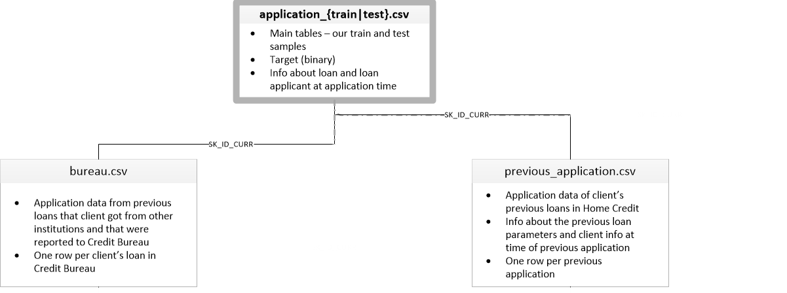

Moreover, we are provided with the definitions of all the columns (in HomeCredit_columns_description.csv).

##### application_train.csv
* This is the main table. I will broke into three set: Train, test and Validation:
  * Tain set: Development of the individual models
  * Test set: Test individual models and select the three best.
* Validation set: Validate ensamble model. This set will only be used once.
* Static data for all applications. One row represents one loan in our data sample.
* The dataset contains 307.511 rows with 122 columns

##### bureau.csv
* All client's previous credits provided by other financial institutions that were reported to Credit Bureau (for clients who have a loan in our sample).
* For every loan in our sample, there are as many rows as number of credits the client had in Credit Bureau before the application date.
* The dataset contains 1.716.428 rows with 17 columns
* There are a lot of columns with 50%-60% of missing data. This should be troublesome.

##### previous_application.csv
* All previous applications for Home Credit loans of clients who have loans in our sample.
* There is one row for each previous application related to loans in our data sample.
* The dataset contains 1.670.214 rows with 37 columns

### Problem Statement
The problem is to determine the return capacity of Home Credit's clients using a wide variety of data such as: Static data for all previous applications, previous credits provided by other financial institutions that were reported to Credit Bureau, ...

Doing so will ensure that clients capable of repayment are not rejected and that loans are given with a principal, maturity, and repayment calendar that will empower their clients to be successful.

### Metrics
Once we have a grasp of the data (reading through the [column descriptions](https://www.kaggle.com/c/home-credit-default-risk/data) helps immensely), we need to understand the metric by which our submission is judged. 

#### ROC AUC

In this case, it is a common classification metric known as the [Receiver Operating Characteristic Area Under the Curve (ROC AUC, also sometimes called AUROC)](https://stats.stackexchange.com/questions/132777/what-does-auc-stand-for-and-what-is-it).

The ROC AUC may sound intimidating, but it is relatively straightforward once you can get your head around the two individual concepts. The [Reciever Operating Characteristic (ROC) curve](https://en.wikipedia.org/wiki/Receiver_operating_characteristic) graphs the true positive rate versus the false positive rate:


A single line on the graph indicates the curve for a single model, and movement along a line indicates changing the threshold used for classifying a positive instance. The threshold starts at 0 in the upper right to and goes to 1 in the lower left. A curve that is to the left and above another curve indicates a better model. For example, the blue model is better than the red model, which is better than the black diagonal line which indicates a naive random guessing model. 

The [Area Under the Curve (AUC)](http://gim.unmc.edu/dxtests/roc3.htm) explains itself by its name! It is simply the area under the ROC curve. (This is the integral of the curve.) This metric is between 0 and 1 with a better model scoring higher. A model that simply guesses at random will have an ROC AUC of 0.5.

When we measure a classifier according to the ROC AUC, we do not generation 0 or 1 predictions, but rather a probability between 0 and 1. This may be confusing because we usually like to think in terms of accuracy, but when we get into problems with inbalanced classes (we will see this is the case), accuracy is not the best metric. For example, if I wanted to build a model that could detect terrorists with 99.9999% accuracy, I would simply make a model that predicted every single person was not a terrorist. Clearly, this would not be effective (the recall would be zero) and we use more advanced metrics such as ROC AUC or the [F1 score](https://en.wikipedia.org/wiki/F1_score) to more accurately reflect the performance of a classifier. A model with a high ROC AUC will also have a high accuracy, but the [ROC AUC is a better representation of model performance.](https://datascience.stackexchange.com/questions/806/advantages-of-auc-vs-standard-accuracy)

#### MAE

In spite of that, I will also use the metric mean absolute error (MAE). MAE is a measure of difference between two continuous variables. Assume X and Y are variables of paired observations that express the same phenomenon. Examples of Y versus X include comparisons of predicted versus observed, subsequent time versus initial time, and one technique of measurement versus an alternative technique of measurement. Consider a scatter plot of n points, where point i has coordinates (xi, yi)... Mean Absolute Error (MAE) is the average vertical distance between each point and the Y=X line, which is also known as the One-to-One line. MAE is also the average horizontal distance between each point and the Y=X line.

The Mean Absolute Error is given by:

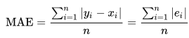


Some researchers have recommended the use of Mean Absolute Error (MAE) instead of Root Mean Square Deviation. MAE possesses advantages in interpretability over RMSD. MAE is the average absolute difference between two variables designated X and Y. MAE is fundamentally easier to understand than the square root of the average of squared errors. Furthermore, each error influences MAE in direct proportion to the absolute value of the error, which is not the case for RMSD ( Pontius, Robert; Thontteh, Olufunmilayo; Chen, Hao (2008). "Components of information for multiple resolution comparison between maps that share a real variable". Environmental Ecological Statistics. 15: 111–142.).


## II. Analysis _(approx. 2-4 pages)_

### Data Exploration
Exploratory Data Analysis (EDA) is an open-ended process where we calculate statistics and make figures to find trends, anomalies, patterns, or relationships within the data. The goal of EDA is to learn what our data can tell us. It generally starts out with a high level overview, then narrows in to specific areas as we find intriguing areas of the data. The findings may be interesting in their own right, or they can be used to inform our modeling choices, such as by helping us decide which features to use.

#### Target
The target is what we are asked to predict: either a 0 for the loan was repaid on time, or a 1 indicating the client had payment difficulties. We can first examine the number of loans falling into each category.

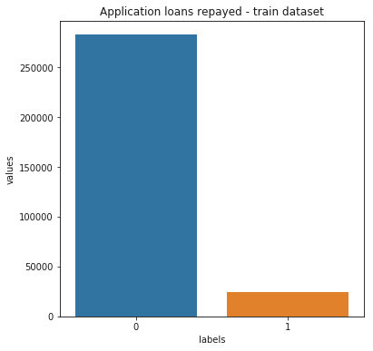

From this information, we see this is an [imbalanced class problem](http://www.chioka.in/class-imbalance-problem/). There are far more loans that were repaid on time than loans (91.9%) that were not repaid (8.1%). Once we get into more sophisticated machine learning models, we can weight the classes by their representation in the data to reflect this imbalance.

#### Application Data

**Contract type**

+ Revolving loans are just a small fraction (10%) from the total number of loans; in the same time, a larger amount of Revolving loans, comparing with their frequency, are not repaid.

**Client gender**

* The number of female clients is almost double the number of male clients. 
* Looking to the percent of defaulted credits, males have a higher chance of not returning their loans (~10%), comparing with women (~7%).

**Flag own car**

+ The clients that owns a car are almost a half of the ones that doesn't own one. 
+ The clients that owns a car are less likely to not repay a car that the ones that own. Both categories have not-repayment rates around 8%.

**Flag own real estate**

+ The clients that owns real estate are more than double of the ones that doesn't own. 
+ Both categories (owning real estate or not owning) have not-repayment rates less than 8%.

**Family Status**

+ Most of clients are married, followed by Single/not married and civil marriage. 
+ In terms of percentage of not repayment of loan, Civil marriage has the highest percent of not repayment (10%), with Widow the lowest (exception being Unknown).

**Nº of childrens**

+ Most of the clients taking a loan have no children. The number of loans associated with the clients with one children are 4 times smaller, the number of loans associated with the clients with two children are 8 times smaller; clients with 3, 4 or more children are much more rare. As for repayment, clients with no children, 1, 2, 3, and 5 children have percents of no repayment around the average (10%). 
+ The clients with 4 and 6 children are above average in terms of percent of not paid back loans (over 25% for families with 6 children). 
+ As for clients with 9 or 11 children, the percent of loans not repaid is 100%.

**Income type of client**

+ Most of applicants for loans are income from Working, followed by Commercial associate, Pensioner and State servant.
+ The applicants with the type of income Maternity leave have almost 40% ratio of not returning loans, followed by Unemployed (37%). The rest of types of incomes are under the average of 10% for not returning loans.

**Education type of the client**

+ Majority of the clients have Secondary / secondary special education, followed by clients with Higher education. Only a very small number having an academic degree.
+ The Lower secondary category, although rare, have the largest rate of not returning the loan (11%). The people with Academic degree have less than 2% not-repayment rate.

**Type of the housing of client**

+ Over 250,000 applicants for credits registered their housing as House/apartment. Following categories have a very small number of clients (With parents, Municipal appartment).
+ From these categories, Rented apartment and With parents have higher than 10% not-repayment rate.

**Region registered not live region and not work region**

+ Very few people are registered in not live or not work region. Generally, the rate of not return is slightly larger for these cases than in the rest (slightly above 8% compared with approx. 8%)

* City registered not live city and not work city:
   + Generally, much more people register in the city they live or work (a larger number register differently in the working city than living city).
   + The ones that register in different city than the working or living city are more frequently not-repaying the loans than the ones that register same city (work 11% or live 12%).
   
**Ocupation type**

+ Most of the loans are taken by Laborers, followed by Sales staff. IT staff take the lowest amount of loans.
+ The category with highest percent of not repaid loans are Low-skill Laborers (above 17%), followed by Drivers and Waiters/barmen staff, Security staff, Laborers and Cooking staff.

**Organization type**

+ Organizations with highest percent of loans not repaid are Transport: type 3 (16%), Industry: type 13 (13.5%), Industry: type 8 (12.5%) and Restaurant (less than 12%).
   
#### Bureau

**Credit Active**

Most of the credits registered at the Credit Bureau are in the status Closed (~900K). On the second place are the Active credits ( a bit under 600K). Sold and Bad debt are just a few.

In the same time, as percent having TARGET = 1 from total number per category, clients with credits registered to the Credit Bureau with Bad debt have 20% default on the currrent applications.

Clients with credits Sold, Active and Closed have percent of TARGET == 1 (default credit) equal or less than 10% (10% being the rate overall). The smallest rate of default credit have the clients with credits registered at the Credit Bureau with Closed credits.

That means the former registered credit history (as registered at Credit Bureau) is a strong predictor for the dafault credit, since the percent of applications defaulting with a history of Bad debt is twice as large as for Sold or Active and almost three times larger as for Closed.

**Credit Currency**

Credits are mostly in currency_1.

Depending on the currency, the percent of clients defaulting is quite different. Starting with currency_3, then currency_1 and currency_2, the percent of clients defaulting is 11%, 8% and 5%. Percent of defaulting applications for clients that have credits registered with currency_4 is close to 0.

**Credit type**

Majority of historical credits registered at the Credit Bureau are Consumer credit and Credit card. Smaller number of credits are Car loan, Mortgage and Microloan.

Looking now to the types of historical credits registered at the Credit Bureau, there are few types with a high percent of current credit defaults, as following:

* Loan for the purchase of equipment - with over 20% current credits defaults; 
* Microloan - with over 20% current credits defaults;
* Loan for working capital replenishement - with over 12% current credits defaults.

**Days Credit** 

The credit duration (in days) is ranging between less than 3000 days (with a local sadle around 2000 days) and with a increasing frequence for shorter number of days - and with a peak around 300 days (or less than one year).

**CREDIT_DAY_OVERDUE** 

Most of the credits have 0 or close to 0 days overdue. The maximum number of credit days overdue is ~3000 days.

**AMT_CREDIT_SUM** 

The distribution of the AMT_CREDIT_SUM shows a concentration of the credits for the lower credit sum range. 

Let's remove the outliers so that we can see better the distribution around 0.

Let's introduce a function to identify and filter the outliers (with a predefined threshold).

Then, let's also modify the function to display a distribution, this time by using the function to filter the outliers.

#### Previous application data

**NAME_CONTRACT_TYPE_y** 

There are three types of contract in the previous application data: Cash loans, Consumer loans, Revolving loans. Cash loans and Consumer loans are almost the same number (~600K) whilst Revolving loans are ~150K.

The percent of defauls loans for clients with previous applications is different for the type of previous applications contracts, decreasing from ~10% for Revolving loans, then ~ 9.5% for Cash loans and ~8% for Consumer loans.

**Cash loan porpouse** 

Besides not identifed/not available categories, Repairs, Other, Urgent needs, Buying a used car, Building a house or an annex accounts for the largest number of contracts.

In terms of percent of defaults for current applications in the sample, clients with history of previous applications have largest percents of defaults when in their history are previous applications for cash loans for Refusal to name the goal - ~23% (which makes a lot of sense), Hobby (20%), Car repairs (~18%).

**Contract Status** 

Most previous applications contract statuses are Approved (~850K), Canceled and Refused (~240K). There are only ~20K in status Unused offer.

In terms of percent of defaults for current applications in the sample, clients with history of previous applications have largest percents of defaults when in their history contract statuses are Refused (12%), followed by Canceled (9%), Unused offer (~8%) and Approved (lowest percent of defaults in current applictions, with less than 8%).

**Payment type** 

Most of the previous applications were paid with Cash through the bank (~850K). Payments using Non-cash from your account or Cashless from the account of the employer are much rare. These three types of payments in previous applications results in allmost the same percent of defaults for current clients (~8% each).

**Client type** 

Most of the previous applications have client type Repeater (~1M), just over 200K are New and ~100K are Refreshed.

In terms of default percent for current applications of clients with history of previous applications, current clients with previous applications have values of percent of defaults ranging from from 8.5%, 8.25% and 7% corresponding to client types in the past New, Repeater and Refreshed, respectivelly.


#### Anomalies

One problem we always want to be on the lookout for when doing EDA is anomalies within the data. These may be due to mis-typed numbers, errors in measuring equipment, or they could be valid but extreme measurements. One way to support anomalies quantitatively is by looking at the statistics of a column using the describe method. The numbers in the DAYS_EMPLOYED column are negative because they are recorded relative to the current loan application.

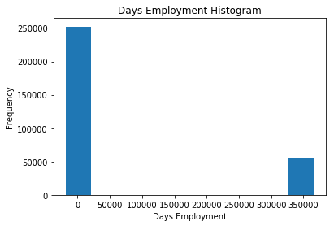

Just out of curiousity, let's subset the anomalous clients and see if they tend to have higher or low rates of default than the rest of the clients.

* The non-anomalies default on 8.66% of loans
* The anomalies default on 5.40% of loans
* There are 55374 anomalous days of employment

Well that is extremely interesting! It turns out that the anomalies have a lower rate of default.

Handling the anomalies depends on the exact situation, with no set rules. One of the safest approaches is just to set the anomalies to a missing value and then have them filled in (using Imputation) before machine learning. In this case, since all the anomalies have the exact same value, we want to fill them in with the same value in case all of these loans share something in common. The anomalous values seem to have some importance, so we want to tell the machine learning model if we did in fact fill in these values. As a solution, we will fill in the anomalous values with not a number (np.nan) and then create a new boolean column indicating whether or not the value was anomalous.

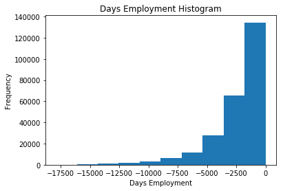

The distribution looks to be much more in line with what we would expect, and we also have created a new column to tell the model that these values were originally anomalous (becuase we will have to fill in the nans with some value, probably the median of the column). The other columns with DAYS in the dataframe look to be about what we expect with no obvious outliers.

#### Correlations

Now that we have dealt with the categorical variables and the outliers, let's continue with the EDA. One way to try and understand the data is by looking for correlations between the features and the target. We can calculate the Pearson correlation coefficient between every variable and the target using the .corr dataframe method.

The correlation coefficient is not the greatest method to represent "relevance" of a feature, but it does give us an idea of possible relationships within the data. Some general interpretations of the absolute value of the correlation coefficent are:

* .00-.19 “very weak”
* .20-.39 “weak”
* .40-.59 “moderate”
* .60-.79 “strong”
* .80-1.0 “very strong”

Let's take a look at some of more significant correlations: the DAYS_BIRTH is the most positive correlation. Looking at the documentation, DAYS_BIRTH is the age in days of the client at the time of the loan in negative days (for whatever reason!). The correlation is positive, but the value of this feature is actually negative, meaning that as the client gets older, they are less likely to default on their loan (ie the target == 0).

The 3 variables with the strongest negative correlations with the target are EXT_SOURCE_1, EXT_SOURCE_2, and EXT_SOURCE_3. According to the documentation, these features represent a "normalized score from external data source". I'm not sure what this exactly means, but it may be a cumulative sort of credit rating made using numerous sources of data.


### Exploratory Visualization

##### Effect of Age on Repayment
As the client gets older, there is a negative linear relationship with the target meaning that as clients get older, they tend to repay their loans on time more often.

Let's start looking at this variable. First, we can make a histogram of the age. We will put the x axis in years to make the plot a little more understandable

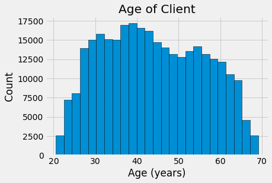

By itself, the distribution of age does not tell us much other than that there are no outliers as all the ages are reasonable. To visualize the effect of the age on the target, we will next make a kernel density estimation plot (KDE) colored by the value of the target. A kernel density estimate plot shows the distribution of a single variable and can be thought of as a smoothed histogram (it is created by computing a kernel, usually a Gaussian, at each data point and then averaging all the individual kernels to develop a single smooth curve). We will use the seaborn kdeplot for this graph.

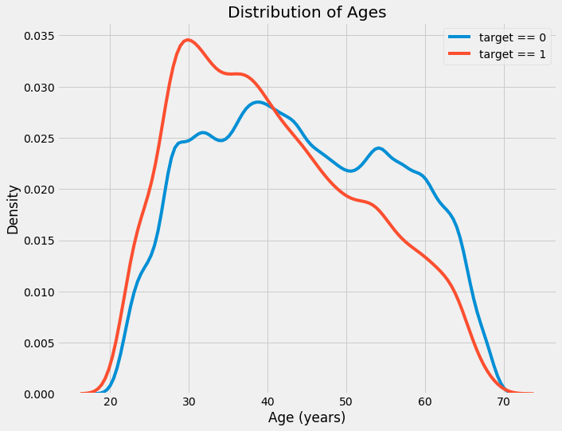

The target == 1 curve skews towards the younger end of the range. Although this is not a significant correlation (-0.07 correlation coefficient), this variable is likely going to be useful in a machine learning model because it does affect the target. Let's look at this relationship in another way: average failure to repay loans by age bracket.

To make this graph, first we cut the age category into bins of 5 years each. Then, for each bin, we calculate the average value of the target, which tells us the ratio of loans that were not repaid in each age category.

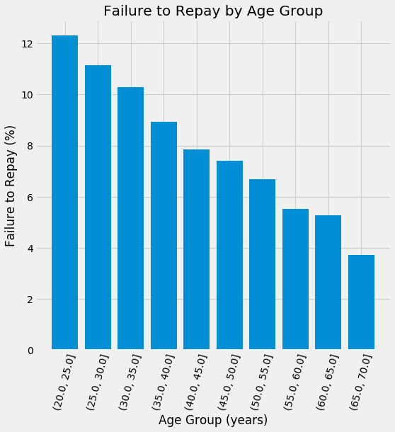

There is a clear trend: younger applicants are more likely to not repay the loan! The rate of failure to repay is above 10% for the youngest three age groups and beolow 5% for the oldest age group.

This is information that could be directly used by the bank: because younger clients are less likely to repay the loan, maybe they should be provided with more guidance or financial planning tips. This does not mean the bank should discriminate against younger clients, but it would be smart to take precautionary measures to help younger clients pay on time.


##### Exterior Sources

First, we can show the correlations of the EXT_SOURCE features with the target and with each other

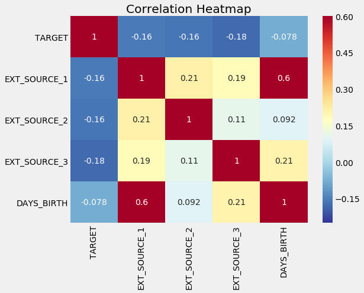

All three EXT_SOURCE featureshave negative correlations with the target, indicating that as the value of the EXT_SOURCE increases, the client is more likely to repay the loan. We can also see that DAYS_BIRTH is positively correlated with EXT_SOURCE_1 indicating that maybe one of the factors in this score is the client age.

Next we can look at the distribution of each of these features colored by the value of the target. This will let us visualize the effect of this variable on the target.

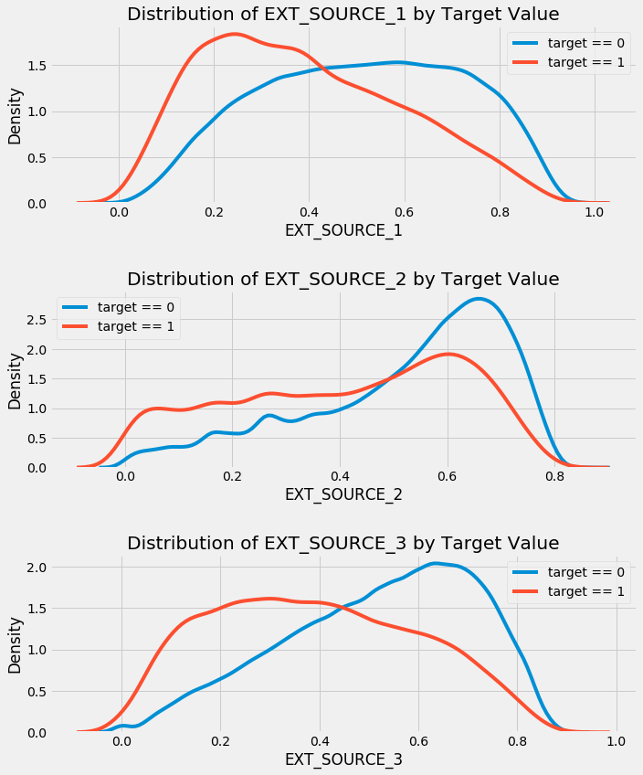

EXT_SOURCE_3 displays the greatest difference between the values of the target. We can clearly see that this feature has some relationship to the likelihood of an applicant to repay a loan. The relationship is not very strong (in fact they are all considered very weak, but these variables will still be useful for a machine learning model to predict whether or not an applicant will repay a loan on time.

##### Pairs Plot
We can make a pairs plot of the EXT_SOURCE variables and the DAYS_BIRTH variable. The Pairs Plot is a great exploration tool because it lets us see relationships between multiple pairs of variables as well as distributions of single variables. Here we are using the seaborn visualization library and the PairGrid function to create a Pairs Plot with scatterplots on the upper triangle, histograms on the diagonal, and 2D kernel density plots and correlation coefficients on the lower triangle.

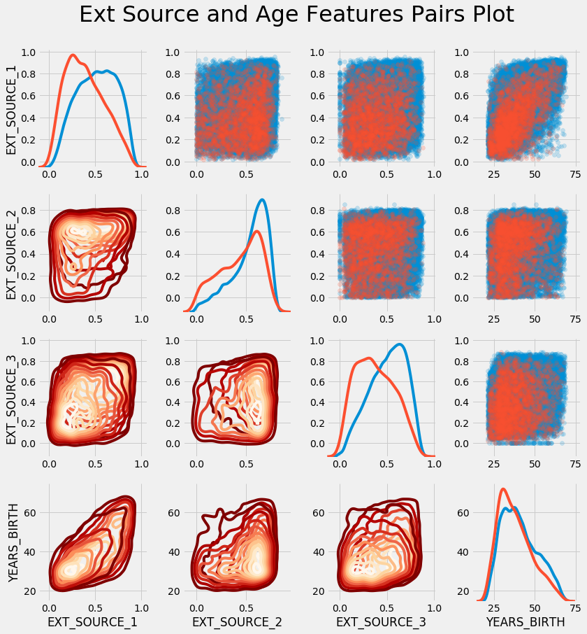


In this plot, the red indicates loans that were not repaid and the blue are loans that are paid. We can see the different relationships within the data. There does appear to be a moderate positive linear relationship between the EXT_SOURCE_1 and the DAYS_BIRTH (or equivalently YEARS_BIRTH), indicating that this feature may take into account the age of the client.


### Algorithms and Techniques

The solution will consist of the application of 4 machine learning models using various techniques:

  * LightGBM
  * XGBoost
  * Random Forest
  * Neural Network)

This 4 models will be compared against the Benchmark and against each other using the metrics area under the ROC and MAE. The 3 best models will be assembled in such a way as to provide a more robust and generalizable final model.

LightGBM, XGBoost and Random Forest are the methods that I usually use in Kaggle competitions and works very fine. Neural networks always work badly for me for these kinds of problems, but I always try to use them and learn from their behavior.

All the techniques applied during the development of the models will be carried out by fixing the seeds in such a way that the solution can be reproduced and occurs more than once.

#### LightGBM
LightGBM is a gradient boosting framework that uses tree based learning algorithms. It is designed to be distributed and efficient with the following advantages:

  * Faster training speed and higher efficiency
  * Lower memory usage
  * Better accuracy
  * Parallel and GPU learning supported
  * Capable of handling large-scale data

Light GBM grows tree vertically while other algorithm grows trees horizontally meaning that Light GBM grows tree leaf-wise while other algorithm grows level-wise. It will choose the leaf with max delta loss to grow. When growing the same leaf, Leaf-wise algorithm can reduce more loss than a level-wise algorithm (https://medium.com/@pushkarmandot/https-medium-com-pushkarmandot-what-is-lightgbm-how-to-implement-it-how-to-fine-tune-the-parameters-60347819b7fc)

LightGBM is being widely-used in many [winning solutions of machine learning competitions](https://github.com/Microsoft/LightGBM/blob/master/examples/README.md#machine-learning-challenge-winning-solutions).

#### XGBoost
XGBoost implements machine learning algorithms under the Gradient Boosting framework. XGBoost provides a parallel tree boosting (also known as GBDT, GBM) that solve many data science problems in a fast and accurate way. T

XGBoost is extensively used by machine learning practitioners, this is a short [list of machine learning winning solutions with XGBoost](https://github.com/dmlc/xgboost/blob/master/demo/README.md#machine-learning-challenge-winning-solutions).

#### Random Forest
Random forests or random decision forests are an ensemble learning method for classification, regression and other tasks, that operate by constructing a multitude of decision trees at training time and outputting the class that is the mode of the classes (classification) or mean prediction (regression) of the individual trees.[1][2] Random decision forests correct for decision trees' habit of overfitting to their training set.

Random Forest is being overtaken by the winners of machine learning competitions by XGBoost, LightGBM or Neural Networks, but it is still widely used to make assembled models.

#### Neural Networks
As the “neural” part of their name suggests, they are brain-inspired systems which are intended to replicate the way that we humans learn. Neural networks consist of input and output layers, as well as (in most cases) a hidden layer consisting of units that transform the input into something that the output layer can use.

For the type of problem we are dealing with, my experience tells me that the neural network will work worse than the other algorithms. Anyway, I like to test the neural networks and learn about their behavior and the best way to configure them.


### Benchmark

To get a baseline, we will use all of the features after encoding the categorical variables. We will preprocess the data by filling in the missing values (imputation) and normalizing the range of the features (feature scaling).

We will use LogisticRegressionfrom Scikit-Learn for our first model. The only change we will make from the default model settings is to lower the regularization parameter, C, which controls the amount of overfitting (a lower value should decrease overfitting). This will get us slightly better results than the default LogisticRegression, but it still will set a low bar for any future models.

Here we use the familiar Scikit-Learn modeling syntax: we first create the model, then we train the model using .fit and then we make predictions on the testing data using .predict_proba (remember that we want probabilities and not a 0 or 1).

Our baseline scores are:

* ROC AUC: 0.71
* MAE: 0.14


## III. Methodology

### Data Preprocessing

#### Missing Values
Next we can look at the number and percentage of missing values in each column. For example, for the application_train.csv has 122 columns and there are 67 columns that have missing values:


When it comes time to build our machine learning models, we will have to:

a. Fill in these missing values (known as imputation). 

  * For categorical and discrete features: use 'mode' in SimpleImputer
  * For continuous features: use 'median' in SimpleImputer

b. For models such as XGBoost that can handle missing values with no need for imputation. 
c. Another option would be to drop columns with a high percentage of missing values, although it is impossible to know ahead of time if these columns will be helpful to our model. Therefore, we will keep all of the columns for now.

#### Encoding Categorical Variables

Before we go any further, we need to deal with pesky categorical variables. A machine learning model unfortunately cannot deal with categorical variables (except for some models such as LightGBM). Therefore, we have to find a way to encode (represent) these variables as numbers before handing them off to the model. There are two main ways to carry out this process:

* Label encoding: assign each unique category in a categorical variable with an integer. No new columns are created. An example is shown below

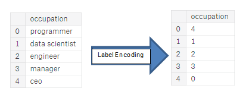

* One-hot encoding: create a new column for each unique category in a categorical variable. Each observation recieves a 1 in the column for its corresponding category and a 0 in all other new columns.

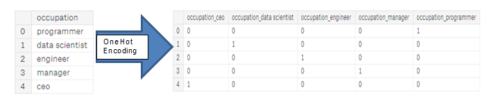

The problem with label encoding is that it gives the categories an arbitrary ordering. The value assigned to each of the categories is random and does not reflect any inherent aspect of the category. In the example above, programmer recieves a 4 and data scientist a 1, but if we did the same process again, the labels could be reversed or completely different. The actual assignment of the integers is arbitrary. Therefore, when we perform label encoding, the model might use the relative value of the feature (for example programmer = 4 and data scientist = 1) to assign weights which is not what we want. If we only have two unique values for a categorical variable (such as Male/Female), then label encoding is fine, but for more than 2 unique categories, one-hot encoding is the safe option.

There is some debate about the relative merits of these approaches, and some models can deal with label encoded categorical variables with no issues. Here is a good Stack Overflow discussion. I think (and this is just a personal opinion) for categorical variables with many classes, one-hot encoding is the safest approach because it does not impose arbitrary values to categories. The only downside to one-hot encoding is that the number of features (dimensions of the data) can explode with categorical variables with many categories. To deal with this, we can perform one-hot encoding followed by PCA or other dimensionality reduction methods to reduce the number of dimensions (while still trying to preserve information).

I will use Label Encoding for any categorical variables with only 2 categories and One-Hot Encoding for any categorical variables with more than 2 categories.

#### Feature Engineering

This represents one of the patterns in machine learning: feature engineering has a greater return on investment than model building and hyperparameter tuning. [This is a great article on the subject](https://www.featurelabs.com/blog/secret-to-data-science-success). As Andrew Ng is fond of saying: "applied machine learning is basically feature engineering."

While choosing the right model and optimal settings are important, the model can only learn from the data it is given. Making sure this data is as relevant to the task as possible is the job of the data scientist (and maybe some automated tools to help us out).

Feature engineering refers to a geneal process and can involve both feature construction: adding new features from the existing data, and feature selection: choosing only the most important features or other methods of dimensionality reduction. There are many techniques we can use to both create features and select features.

We will do a lot of feature engineering when we start using the other data sources, but in this notebook we will try only two simple feature construction methods:

* Polynomial features
* Domain knowledge features

##### Polynomial features

One simple feature construction method is called polynomial features. In this method, we make features that are powers of existing features as well as interaction terms between existing features. For example, we can create variables EXT_SOURCE_1^2 and EXT_SOURCE_2^2 and also variables such as EXT_SOURCE_1 x EXT_SOURCE_2, EXT_SOURCE_1 x EXT_SOURCE_2^2, EXT_SOURCE_1^2 x  EXT_SOURCE_2^2, and so on. These features that are a combination of multiple individual variables are called interaction terms because they capture the interactions between variables. In other words, while two variables by themselves may not have a strong influence on the target, combining them together into a single interaction variable might show a relationship with the target. Interaction terms are commonly used in statistical models to capture the effects of multiple variables, but I do not see them used as often in machine learning. Nonetheless, we can try out a few to see if they might help our model to predict whether or not a client will repay a loan.

We will create polynomial features using the EXT_SOURCE variables and the DAYS_BIRTH variable. Scikit-Learn has a useful class called PolynomialFeatures that creates the polynomials and the interaction terms up to a specified degree. We can use a degree of 3 to see the results (when we are creating polynomial features, we want to avoid using too high of a degree, both because the number of features scales exponentially with the degree, and because we can run into problems with overfitting).

##### Domain knowledge features

We can make a couple features that attempt to capture what we think may be important for telling whether a client will default on a loan. Here I'm going to use five features that were inspired by this script by Aguiar:

* CREDIT_INCOME_PERCENT: the percentage of the credit amount relative to a client's income
* ANNUITY_INCOME_PERCENT: the percentage of the loan annuity relative to a client's income
* CREDIT_TERM: the length of the payment in months (since the annuity is the monthly amount due
* DAYS_EMPLOYED_PERCENT: the percentage of the days employed relative to the client's age
* OVER_EXPECT_CREDIT: Indicator AMT Credit > AMT Goods
* INCOME_PER_FAMILY_MEMBER: Income per family member
* MEAN_BUILDING_SCORE_AVG
* TOTAL_BUILDING_SCORE_AVG
* FLAG_DOCUMENT_TOTAL
* AMT_REQ_CREDIT_BUREAU_TOTAL

Otro tipo de variables que vamos a calcular son las provinientes de Bureau y Previous Applications. Para ello calcularemos variables agregadas y el resultado de la última aplicación.


#### Scaler

As a last step, we will scale the variables to be between 0 and 1. Scaling is a method used to standardize the range of independent variables or features of data. In data processing, it is also known as data normalization and is generally performed during the data preprocessing step.

To do this we will use skLearn's MinMaxScaler. Also known as min-max scaling or min-max normalisation, is the simplest method and consists in rescaling the range of features to scale the range in [0, 1] or [−1, 1]. Selecting the target range depends on the nature of the data. The general formula is given as:

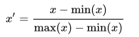

x' is the normalized value.


### Implementation
To carry out the development of the models and all the preprocessing of the data, basically this libraries have been used:

* [scikit-learn](http://scikit-learn.org/stable/)
* [LightGBM](https://github.com/Microsoft/LightGBM)
* [XGBoost](https://github.com/dmlc/xgboost)
* [Keras](https://github.com/keras-team/keras)
* [TensorFlow](https://github.com/tensorflow/tensorflow)

Additionally, libraries have been used to create graphs:

* [seaborn](https://seaborn.pydata.org/)
* [plotly](https://plot.ly/)

In order to simplify the testing of the models and to test the hyperparameters of the models, functions have been developed to encapsulate the training phase. A first function encapsulates the kFolds preparation for CrossValidation and calculates the AUC and MAE metrics for each set.


```python
from sklearn.model_selection import KFold
from sklearn.metrics import roc_auc_score, mean_absolute_error
from sklearn.utils.multiclass import type_of_target

import gc

def model(model_func, features, test_features, params, validation_features=None, n_folds = 5): 
    """Train, test and validation a model using cross validation. 
    
    Parameters
    --------
        model_func:
            Function call that train the specific model
        features (pd.DataFrame): 
            dataframe of training features to use 
            for training a model. Must include the TARGET column.
        test_features (pd.DataFrame): 
            dataframe of testing features to use
            for making predictions with the model. 
        params
            Params set that will be passed to the model
        validation_features (pd.DataFrame): 
            dataframe of validation features to use
            for making predictions with the model. 
        
        
    Return
    --------
        feature_importances (pd.DataFrame): 
            dataframe with the feature importances from the model.
        metrics (pd.DataFrame): 
            dataframe with training and validation metrics (ROC AUC, MAE) for each fold and overall.
        validation_metrics (pd.DataFrame): 
            dataframe with metrics (ROC AUC, MAE) for validation dataframe.
    """
    
    # Extract the ids
    train_ids = features['SK_ID_CURR']
    test_ids = test_features['SK_ID_CURR']
    if validation_features is not None:
        validation_ids = test_features['SK_ID_CURR']
    
    # Extract the labels for training
    labels = np.array(features['TARGET'].astype(int))
    test_labels = np.array(test_features['TARGET'].astype(int))
    if validation_features is not None:
        validation_labels = np.array(validation_features['TARGET'].astype(int))
    
    # Remove the ids and target
    features = features.drop(['SK_ID_CURR', 'TARGET'], axis=1)
    test_features = test_features.drop(['SK_ID_CURR', 'TARGET'], axis=1)
    if validation_features is not None:
        validation_features = validation_features.drop(['SK_ID_CURR', 'TARGET'], axis=1)
    
    print('Training Data Shape: ', features.shape)
    print('Testing Data Shape: ', test_features.shape)
    if validation_features is not None:
        print('Validation Data Shape: ', test_features.shape)
    
    # Extract feature names
    feature_names = list(features.columns)
    
    # Convert to np arrays
    features = np.array(features)
    test_features = np.array(test_features)
    if validation_features is not None:
        validation_features = np.array(validation_features)
        
    # Create the kfold object
    k_fold = KFold(n_splits = n_folds, shuffle = True, random_state = 50)
    
    # Empty array for feature importances
    feature_importance_values = np.zeros(len(feature_names))
    
    # Empty array for test predictions
    test_predictions = np.zeros(test_features.shape[0])
    if validation_features is not None:
        validation_predictions = np.zeros(validation_features.shape[0])
        
    # Empty array for out of fold validation predictions
    out_of_fold = np.zeros(features.shape[0])
    
    # Lists for recording validation and training scores
    valid_scores_auc = []
    train_scores_auc = []
    valid_scores_mae = []
    train_scores_mae = []
    
    # Iterate through each fold
    for train_indices, valid_indices in k_fold.split(features):
        
        # Training data for the fold
        train_features, train_labels = features[train_indices], labels[train_indices]
        # Validation data for the fold
        valid_features, valid_labels = features[valid_indices], labels[valid_indices]
        
        valid_score_auc, train_score_auc, valid_score_mae, train_score_mae, feature_importance_values_l, test_predictions_l, validation_predictions_l = model_func(train_features, train_labels, valid_features, valid_labels, test_features, validation_features, params)

        # Record the feature importances
        feature_importance_values += feature_importance_values_l / k_fold.n_splits

        # Make predictions
        test_predictions += test_predictions_l / k_fold.n_splits
        if validation_features is not None:
            validation_predictions += validation_predictions_l / k_fold.n_splits
        
        valid_scores_auc.append(valid_score_auc)
        train_scores_auc.append(train_score_auc)
        valid_scores_mae.append(valid_score_mae)
        train_scores_mae.append(train_score_mae)
        
        # Clean up memory
        gc.enable()
        del train_features, valid_features
        gc.collect()
        
    # Make the feature importance dataframe
    feature_importances = pd.DataFrame({'feature': feature_names, 'importance': feature_importance_values})
    
    # Overall validation score
    valid_auc = roc_auc_score(test_labels, test_predictions)
    valid_mae = mean_absolute_error(test_labels, test_predictions)
    if validation_features is not None:
        validation_auc = roc_auc_score(validation_labels, validation_predictions)
        validation_mae = mean_absolute_error(validation_labels, validation_predictions)
    
    # Add the overall scores to the metrics
    valid_scores_auc.append(valid_auc)
    train_scores_auc.append(np.mean(train_scores_auc))
    valid_scores_mae.append(valid_mae)
    train_scores_mae.append(np.mean(train_scores_mae))
    
    # Needed for creating dataframe of validation scores
    fold_names = list(range(n_folds))
    fold_names.append('overall')
    
    # Dataframe of validation scores
    metrics = pd.DataFrame({'fold': fold_names,
                            'train auc': train_scores_auc,
                            'test auc': valid_scores_auc,
                            'train mae': train_scores_mae,
                            'test mae': valid_scores_mae}) 

    if validation_features is not None:
        validation_metrics = pd.DataFrame({'auc': [validation_auc],
                                           'mae': [validation_mae]}) 
    else:
        validation_metrics = None
        

    return feature_importances, metrics, validation_metrics

import lightgbm as lgb
```

A second specific function for each model encapsulates model definition, training and evaluation in the test and evaluation sets. To be able to train models with different parameters, an input parameter is used to specify them. For example, the following function has been developed for LightGBM:

```python
def train_LGBMClassifier(train_features, train_labels, valid_features, valid_labels, test_features, validation_features, params):
    # Create the model
    model = lgb.LGBMClassifier(application="binary", boosting_type=params["boosting"],
                      learning_rate=params["learning_rate"],n_estimators=params["n_estimators"],
                      reg_alpha = params["reg_alpha"], reg_lambda = params["reg_lambda"], 
                      drop_rate=params["drop_rate"],
                      num_leaves=params["num_leaves"], max_depth=params["max_depth"],
                      max_bin=params["max_bin"],
                      subsample = 0.8, n_jobs = -1, random_state = 50)
    
    # Train the model
    model.fit(train_features, train_labels, eval_metric = ['auc', 'mae'],
              eval_set = [(valid_features, valid_labels), (train_features, train_labels)],
              eval_names = ['valid', 'train'],
              early_stopping_rounds = params["early_stopping_rounds"], verbose = 200)
    
    # Record the best iteration
    best_iteration = model.best_iteration_
    
    # Record the feature importances
    feature_importance_values = model.feature_importances_
    
    # Make predictions
    test_predictions = model.predict_proba(test_features, num_iteration = best_iteration)[:, 1]
    if validation_features is not None:
        validation_predictions = model.predict_proba(validation_features, num_iteration = best_iteration)[:, 1]
    else:
        validation_predictions=None
        
    # Record the best score
    valid_score_auc = model.best_score_['valid']['auc']
    train_score_auc = model.best_score_['train']['auc']
    valid_score_mae = model.best_score_['valid']['l1']
    train_score_mae = model.best_score_['train']['l1']

    return valid_score_auc, train_score_auc, valid_score_mae, train_score_mae, feature_importance_values, test_predictions, validation_predictions
```

### Refinement

In the first phase of the training of each model, it has been carried out with a discreet set of parameters. This has allowed us to learn how parameters affect the model's behavior. For example, for the lightGBM model, start the training with the following set of parameters:

```python
lgbm_params = {
    "boosting":"dart",
    "application":"binary",
    "learning_rate": 0.1,
    'reg_alpha':0.01,
    'reg_lambda': 0.01,
    "n_estimators":10000,
    "max_depth":7,
    "num_leaves":100,
    "max_bin":225,
    "drop_rate":0.02,
    "early_stopping_rounds": 200
}
```

Esto nos proporcionaba el siguiente resultado:

|   fold | train auc | train mae |  test auc |  test mae |
|-------:|----------:|----------:|----------:|----------:|
|      0 |  0.877069 |  0.129895 |  0.754396 |  0.137714 |
|      1 |  0.899392 |  0.127401 |  0.751671 |  0.138821 |
|      2 |  0.918464 |  0.123621 |  0.741702 |  0.136253 |
|      3 |  0.903891 |  0.125270 |  0.754107 |  0.137266 |
|      4 |  0.877004 |  0.130056 |  0.746761 |  0.140161 |
|overall |  0.895164 |  0.127249 |  0.743577 |  0.174889 |

As we can see between the training and test values there is a lot of difference for both metrics (auc and mae). This means that we are over-adjusting the model and that it is spreading badly. To try to avoid this, we are going to increase the parameters of reg_alpha, reg_lambda and num_leaves.

```python
lgbm_params = {
    "boosting":"gbdt",
    "application":"binary",
    "learning_rate": 0.1,
    'reg_alpha':0.1,
    'reg_lambda': 0.1,
    "n_estimators":10000,
    "max_depth":7,
    "num_leaves":200,
    "max_bin":225,
    "drop_rate":0.02,
    "early_stopping_rounds": 200
}
```

|   fold | train auc | train mae |  test auc |  test mae |
|-------:|----------:|----------:|----------:|----------:|
|      0 |  0.857283 |  0.128797 |  0.754204 |  0.135583 |
|      1 |  0.864312 |  0.127534 |  0.750568 |  0.136090 |
|      2 |  0.865789 |  0.127649 |  0.741182 |  0.134877 |
|      3 |  0.859313 |  0.128261 |  0.750489 |  0.136315 |
|      4 |  0.841988 |  0.130212 |  0.748010 |  0.137620 |
|overall |  0.857737 |  0.128491 |  0.748855 |  0.136097 |

We note that we have reduced the over-adjustment but it is still excessive. We are going to reduce the max_depth to see how it affects the model:

```python
lgbm_params = {
    "boosting":"gbdt",
    "application":"binary",
    "learning_rate": 0.1,
    'reg_alpha':0.1,
    'reg_lambda': 0.1,
    "n_estimators":10000,
    "max_depth":5,
    "num_leaves":200,
    "max_bin":225,
    "drop_rate":0.02,
    "early_stopping_rounds": 200
}
```

|   fold | train auc | train mae |  test auc |  test mae |
|-------:|----------:|----------:|----------:|----------:|
|      0 |  0.809402 |  0.133003 |  0.756757 |  0.135961 |
|      1 |  0.800085 |  0.133561 |  0.752171 |  0.137080 |
|      2 |  0.817467 |  0.132307 |  0.742536 |  0.135511 |
|      3 |  0.804870 |  0.133318 |  0.754814 |  0.136936 |
|      4 |  0.802916 |  0.132993 |  0.749148 |  0.137526 |
|overall |  0.806948 |  0.133036 |  0.751054 |  0.136603 |

With this we manage to reduce considerably the over-adjustment and improve the results in the test set. Let's keep increasing reg_alpha and reg_lambda to see how the model behaves

```python
lgbm_params = {
    "boosting":"gbdt",
    "application":"binary",
    "learning_rate": 0.1,
    'reg_alpha':10,
    'reg_lambda': 10,
    "n_estimators":10000,
    "max_depth":5,
    "num_leaves":200,
    "max_bin":225,
    "drop_rate":0.02,
    "early_stopping_rounds": 200
}
```

|   fold | train auc | train mae |  test auc |  test mae |
|-------:|----------:|----------:|----------:|----------:|
|      0 |  0.804923 |  0.132783 |  0.758607 |  0.135634 |
|      1 |  0.810282 |  0.131917 |  0.755165 |  0.136259 |
|      2 |  0.839153 |  0.129431 |  0.744734 |  0.134666 |
|      3 |  0.802204 |  0.132817 |  0.757222 |  0.136272 |
|      4 |  0.786282 |  0.133990 |  0.750687 |  0.137447 |
|overall |  0.808569 |  0.132187 |  0.753242 |  0.136055 |

With these new parameters the model continues to improve and the over-adjustment is reduced. Let's increase reg_alpha and reg_lambda a little more

```python
lgbm_params = {
    "boosting":"gbdt",
    "application":"binary",
    "learning_rate": 0.1,
    'reg_alpha':100,
    'reg_lambda': 100,
    "n_estimators":10000,
    "max_depth":5,
    "num_leaves":200,
    "max_bin":225,
    "drop_rate":0.02,
    "early_stopping_rounds": 200
}
```

|   fold | train auc | train mae |  test auc |  test mae |
|-------:|----------:|----------:|----------:|----------:|
|      0 |  0.762467 |  0.136550 |  0.755720 |  0.136691 |
|      1 |  0.762417 |  0.136328 |  0.751304 |  0.137598 |
|      2 |  0.765354 |  0.136652 |  0.738559 |  0.136303 |
|      3 |  0.762273 |  0.136332 |  0.753829 |  0.137300 |
|      4 |  0.763035 |  0.135850 |  0.747742 |  0.137952 |
|overall |  0.763109 |  0.136342 |  0.749405 |  0.137169 |

These parameters eliminate model over-fitting but are beginning to reduce the model fit in the test set. That is why we will keep the previous parameters as the optimal set of parameters.

The initial idea was to make a GridSearch around the optimal parameters to try to improve them systematically. Due to the lack of time I will not be able to do it and it will be an improvement that we could apply to the project in later phases. 

Once the set of parameters that work best for each model has been determined, a new training session is carried out with these but reducing the learning_rate and increasing the early_stopping_round. This allows us to achieve a more precise model:

```python
lgbm_params = {
    "boosting":"gbdt",
    "application":"binary",
    "learning_rate": 0.01,
    'reg_alpha':10,
    'reg_lambda': 10,
    "n_estimators":10000,
    "max_depth":5,
    "num_leaves":200,
    "max_bin":225,
    "drop_rate":0.02,
    "early_stopping_rounds": 500
}
```

|   fold | train auc | train mae |  test auc |  test mae |
|-------:|----------:|----------:|----------:|----------:|
|      0 |  0.799976 |  0.133356 |  0.759345 |  0.135787 |
|      1 |  0.824688 |  0.130651 |  0.756150 |  0.136032 |
|      2 |  0.838521 |  0.129669 |  0.745448 |  0.134684 |
|      3 |  0.806708 |  0.132529 |  0.757741 |  0.136270 |
|      4 |  0.799670 |  0.132761 |  0.750934 |  0.137081 |
|overall |  0.813913 |  0.131793 |  0.753863 |  0.135971 |

This procedure has been repeated for the remaining three Algorithms: XGBoost, Random Forest and Neural Networks.


## IV. Results

### Model Evaluation and Validation

The data set was divided into three sets at the beginning of the development:

* Training: 70% Training of the models with the different hyperparameters
* Test: 15% Test of the trained models and selection of the optimal parameters for each model
* Validation: 15% Validation of the trained model with the optimal parameters

The use of a validation set allows us to check that the final model is not overfitting the test set and that it therefore generalizes well to data never seen before.

We have trained the models with 5-fold Cross Validation. This allows us assessing how the results of a statistical analysis will generalize to an independent data set.

#### LightGBM

Final model for Train and Test sets:

|   fold | train auc | train mae |  test auc |  test mae |
|-------:|----------:|----------:|----------:|----------:|
|      0 |  0.799976 |  0.133356 |  0.759345 |  0.135787 |
|      1 |  0.824688 |  0.130651 |  0.756150 |  0.136032 |
|      2 |  0.838521 |  0.129669 |  0.745448 |  0.134684 |
|      3 |  0.806708 |  0.132529 |  0.757741 |  0.136270 |
|      4 |  0.799670 |  0.132761 |  0.750934 |  0.137081 |
|overall |  0.813913 |  0.131793 |  0.755136 |  0.134778 |

And for Validation set:

| validation auc | validation mae  |
|--------:|----------:|
| 0.75427 |  0.136778 |

Feature Importance
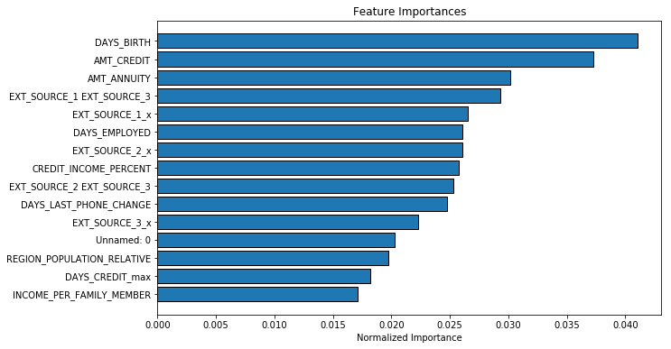

#### XGBoost

Final model for Train and Test sets:

|   fold | train auc | train mae |  test auc |  test mae |
|-------:|----------:|----------:|----------:|----------:|
|      0 |  0.800356 |  0.175951 |  0.760208 |  0.179332 |
|      1 |  0.815663 |  0.173102 |  0.756419 |  0.178766 |
|      2 |  0.832357 |  0.170903 |  0.745785 |  0.177056 |
|      3 |  0.805345 |  0.174835 |  0.758861 |  0.179310 |
|      4 |  0.808089 |  0.173899 |  0.751224 |  0.179472 |
|overall |  0.812362 |  0.173738 |  0.753815 |  0.177272 |

And for Validation set:

| validation auc | validation mae  |
|--------:|----------:|
| 0.75406 | 0.178741  |

Feature Importance
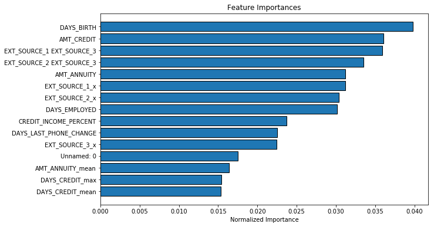


#### Random Forest

Final model for Train and Test sets:

|   fold | train auc | train mae |  test auc |  test mae |
|-------:|----------:|----------:|----------:|----------:|
|      0 |  0.815903 |  0.373415 |  0.745989 |  0.380471 |
|      1 |  0.815756 |  0.372505 |  0.740438 |  0.381075 |
|      2 |  0.816085 |  0.371522 |  0.729519 |  0.380275 |
|      3 |  0.815061 |  0.372933 |  0.744043 |  0.380089 |
|      4 |  0.815200 |  0.372551 |  0.736795 |  0.380621 |
|overall |  0.815601 |  0.372585 |  0.739247 |  0.379972 |

And for Validation set:

| validation auc | validation mae  |
|--------:|----------:|
| 0.741533 | 0.379821  |

Feature Importance
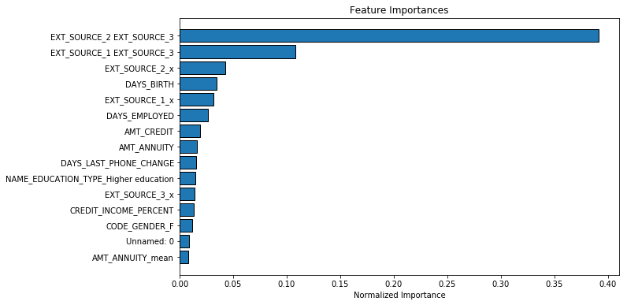


#### Neural Network

Model for Train and Test sets:

|   fold | train auc | train mae |  test auc |  test mae |
|-------:|----------:|----------:|----------:|----------:|
|      0 |  0.5912   |  0.1469   |  0.5913   |  0.1453   |


#### LightGBM + XGBoost

As we can see, the models that best fit both metrics (AUC and MAE) are LightGBM and XGBoost.

Random Forest observed that the AUC metric behaves well, at the level of the two previous ones, but that the MAE metric almost doubles. This is indicating that Random Forest is detecting more false positives (predicts 1 when it is 0) than LightGBM and XGBoost.

In contrast, the neural network has an MAE similar to XGBoost and LightGBM, but a very low AUC, even worse than the Logistic regression. This indicates that the neural network is commenting on many false negatives (predicts 0 when it is 1)

Although our initial idea was to build a final model assembling the 3 best ones, seeing the results, we believe that the ideal is that our final model is composed only of the two best ones: LightGBM and XGBoost.

|   fold | test auc | test mae | validation auc | validation mae |
|-------:|----------:|----------:|----------:|----------:|
|      0 |  0.753623 |  0.156608 |  0.753465 |  0.158393 |
|      1 |  0.753727 |  0.155767 |  0.753058 |  0.157511 |
|      2 |  0.753032 |  0.155429 |  0.753366 |  0.157099 |
|      3 |  0.752972 |  0.156461 |  0.753559 |  0.158090 |
|      4 |  0.753734 |  0.155860 |  0.752580 |  0.157704 |
|overall |  0.754721 |  0.156025 |  0.754565 |  0.157760 |


### Justification

Analyzing the results of the LightGBM + XGBoost model we can conclude that the model obtains significantly better results than the Benchmark in AUC metric. As for MAE, it is slightly above the benchmark. This indicates that it is committing more false negatives than the benchmark.

This has led us to think more carefully about whether the MAE metric was the right one for this problem. The MAE is the average vertical distance between predicted versus observed. As our target variable is very balanced (8% of 1), a model that always predicts zero has a MAE of 0.08. All models developed in this project have a much higher MAE, including the benchmark. This indicates that models are tending to detect 1 when they are actually a 0. 

Comparing the results of our models with Kaggle's LeaderBoard, we see that we are still a long way from the top positions. This indicates that there is still much room for improvement in the models.


## V. Conclusion

### Reflection
In this project, we saw how to get started with a machine learning problem. We first made sure to understand the data, our task, and the metric by which our submissions will be judged. Then, we performed a EDA to try and identify relationships, trends, or anomalies that may help our modeling. Along the way, we performed necessary preprocessing steps such as encoding categorical variables, imputing missing values, and scaling features to a range. Then, we constructed new features out of the existing data to see if doing so could help our model.

Once the data exploration, data preparation, and feature engineering was complete, we implemented a baseline model upon which we hope to improve. 

Once the baseline was developed, we trained 4 different models: LightGBM, XGBoost, Random Forest and a Neural Network.

We have found that LightGBM, XGBoost and Random Forest substantially improve baseline performance based on the AUC metric. In contrast, the neural network was not able to approach the baseline results.

Regarding the MAE metric, we see that only LightGBM is capable of improving the baseline, while XGBoost is not. After developing the model, I believe that the MAE metric is not the most appropriate for the problem due to having such an unbalanced target. 

Finally, we have built a model that consists of combining the LightGBM and XGBoost models. 

We followed the general outline of a machine learning project:

* Understand the problem and the data
* Data cleaning and formatting (this was mostly done for us)
* Exploratory Data Analysis
* Baseline model
* Improved models
* Model Merging
* Model interpretation (just a little)


### Improvement
As we can see from Kaggle's LeaderBoard, our models are still far from approaching the best models in the competition. That is why we still have a long way to go in this project. 

In our view, these are the 6 main points for improvement:

* As you can see, during the development of the project we have only 3 of the 6 datasets provided in the Kaggle competition. The main improvement would be to include the other 3 datasets in the development of the models and build variables with them.
* We will need to think about whatother domain knowledge features may be useful for this problem (or we should consult someone who knows more about the financial industry!
* Use of unbalancing techniques. Try Oversampling and undersampling to adjust the class distribution of a data set (i.e. the ratio between the different classes/categories represented).
* Use of anomaly detection techniques. A different approach would be to view the problem as an anomaly detection problem, where the 1 in the set are anomalies within the 0. 
* Systematic search for parameters: GridSearchCV. GridSearchCV exhaustively generates candidates from a grid of parameter values specified with the param_grid parameter. This search could be performed with Cross Validation of 5 Fold for LightGBM with the following code:


```python
param_grid = {
    "boosting": ["gbdt", "dart"],
    "application":["binary"],
    'learning_rate': [0.01, 0.1, 1, 10],
    'reg_alpha': [0.01, 0.1, 1],
    'reg_lambda': [0.01, 0.1, 1],
    "n_estimators": [10000],
    "max_depth": [3, 5, 7],
    'num_leaves': [31, 127],
    "max_bin": [225],
    'feature_fraction': [0.5, 1.0],
    'bagging_fraction': [0.75, 0.95], 
    "drop_rate": [0.02]
    }

lgbc_fit_params = {
    "eval_names": ['valid', 'train'],
    "eval_set" : [[test, test_labels]],
    'eval_metric' : ['auc', 'mae'], # string, list of strings, callable or None, optional (default=None)
    'early_stopping_rounds' : 200, # int or None, optional (default=None)
    'verbose': 200
}

lgb_Classifier = lgb.LGBMClassifier(
                         bagging_freq=5,
                         eval_metric=['auc', 'mae'],
                         subsample = 0.8, n_jobs = -1, random_state = 50)

gsearch = GridSearchCV(estimator=lgb_Classifier, 
                       param_grid=param_grid, 
                       fit_params=lgbc_fit_params,
                       cv=k_fold,
                       return_train_score=True,
                       scoring='roc_auc') 

lgb_model = gsearch.fit(X=train, 
                        y=train_labels)

```

* Neural Network Architecture: During the development of the project we have only used a neural network architecture. A point of improvement would be to try different neurolane network architectures.

